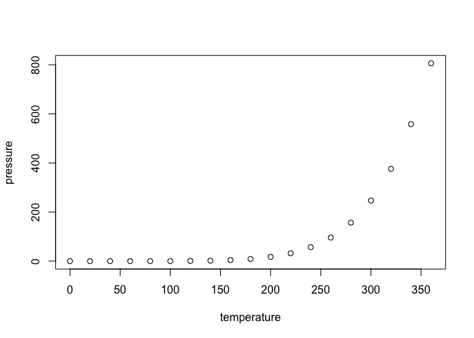

## README

<p xmlns:cc="http://creativecommons.org/ns#" >This work is licensed under <a href="https://creativecommons.org/licenses/by-nc/4.0/?ref=chooser-v1" target="_blank" rel="license noopener noreferrer" style="display:inline-block;">Creative Commons Attribution-NonCommercial 4.0 International</a></p>

<!-- README.md is generated from README.Rmd. Please edit that file -->

## UrbanRunoffRisk

<!-- badges: start -->
<!-- badges: end -->

This package provides functions to calculate hazard and
risk of urban runoff with chemical mixtures using input from Excel files.

## Installation

You can install the development version of UrbanRunoffRisk following the 
steps below:

``` r
# Install devtools if not already installed
install.packages("devtools")

# Install the UrbanRunoffRisk package
devtools::install_github("wenxiliao/UrbanRunoffRisk")
```

## Example Usage

This is a basic example which shows you how to solve a common problem:

### Prerequisites
Ensure you have the required packages installed:
```R
# Install required packages
install.packages("readxl")
```

``` r
library(UrbanRunoffRisk)
library(readxl)

# Read the Excel file
runoff_metals = read_excel(data/UrbanRunoff_Metals.xlsx)

# Inspect the first few rows
head(runoff_metals)

# Calculate Risk Quotient (PEC/PNEC)
calculate_RQ_PEC_PNEC()

# Calculate Risk Quotient (STU)
calculate_RQ_STU()

```

``` r
summary(cars)
#>      speed           dist       
#>  Min.   : 4.0   Min.   :  2.00  
#>  1st Qu.:12.0   1st Qu.: 26.00  
#>  Median :15.0   Median : 36.00  
#>  Mean   :15.4   Mean   : 42.98  
#>  3rd Qu.:19.0   3rd Qu.: 56.00  
#>  Max.   :25.0   Max.   :120.00
```

You’ll still need to render `README.Rmd` regularly, to keep `README.md`
up-to-date. `devtools::build_readme()` is handy for this.

You can also embed plots, for example:



In that case, don’t forget to commit and push the resulting figure
files, so they display on GitHub and CRAN.

